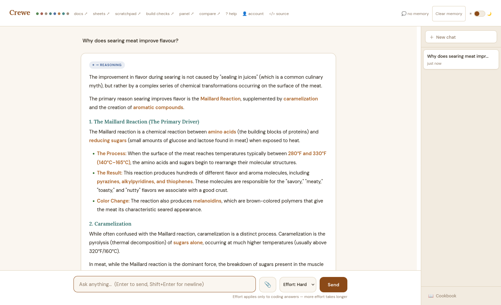

# Crewe

**A self-hosted junction for your local LLMs.** Crewe reads each question, classifies it with a small fast model, and routes it to the right specialist — cooking, creative writing, a dedicated coder, reasoning, live web search — running on your own hardware, hosted APIs, or any mix.

> Named for Crewe, the Cheshire town that exists because railway lines met there.



## Features

**Routing**
- A lightweight classifier picks the specialist per question; short continuations ("no", "keep going") stick with the previous route
- **Settings UI** (`/settings`): register backends by type — **llama.cpp**, **Ollama**, **Claude (Anthropic)**, or any OpenAI-compatible server or hosted API — and point any route at any backend, add custom routes — with an AI helper that drafts the routing rule and a **live routing test** that runs your example questions through the real classifier before you commit. Changes apply live, no restart.
- Route health dots in the header — see a dead backend at a glance
- **Effort tiers for coding** — *fast*, *normal* and *extra*: register your
  quickest model, your everyday one, and your strongest (often a paid API),
  then pick per question. Budgets are sized automatically from each backend's
  real context window, so a small model is never handed a prompt it cannot
  hold, and any tier you skip falls back to the one above it

**Coding that proves itself**
- Agentic code pipeline: plan → per-step build → foreman check → delivery inspection → real-browser runtime gate
- **Behavior verification**: the model writes click/assert checks, the harness runs them in headless Firefox; bug reports are *reproduced* before fixing and re-verified after (SWE-agent style)
- Working memory per job (what was tried, what failed and survived) so retries never loop the same fix; jobs are auditable in a per-job markdown log
- Builds are playable in-app at `/play/<session>/`

**Reading your documents**
- Attach a `.pdf`, `.docx`, `.xlsx`, `.md`, `.csv` or source file to a conversation
- A **summarize** route for condensing material you already have, tuned to stay
  faithful — names, numbers and dates kept verbatim, nothing invented
- Attachments belong to the conversation, not to one question, so you can ask
  follow-ups about the same document on any route
- Documents too large for the model's window are summarised in passes rather
  than truncated, so the end of a long report still counts

**An office suite, self-hosted**
- **Docs**: Google-Docs-style editor (styles, colors, alignment) with autosave; ask the AI to write and watch it type into the page live; print-perfect PDF via the browser
- **Sheets**: spreadsheet with a real formula engine (SUM/AVERAGE/MIN/MAX/ROUND, ranges, cycle detection), multi-cell selection, column resize, cell formatting and number formats; AI fills sheets *with working formulas*; CSV export
- **Cookbook**: recipes auto-saved from chat, each with an auto-fetched photo
- **Accounts**: e-mail + password login, invite links, per-user data isolation
- Extras: HTML scratchpad with live preview, multi-model panel, A/B code comparisons

**Polish**
- Warm light/dark theme across every page, one toggle, no CDN dependencies — fonts and JS vendored, fully offline
- Conversation memory per session (recent turns verbatim, older summarized)
- Web search route via self-hosted SearXNG with cited sources

## Architecture

```
                    ┌────────────┐
 question ──────►   │   Crewe    │  Flask, one file: router.py
                    │ classifier │  (small model, configurable)
                    └─────┬──────┘
      ┌──────────┬────────┼──────────┬───────────┐
      ▼          ▼        ▼          ▼           ▼
   recipes   creative   code      general/    search        + your custom
   backend   backend    backend   reasoning   SearXNG +       routes
                                  backend     backend
```

Every backend is any OpenAI-compatible chat endpoint. Mix local and remote machines, or hosted APIs, freely.

## Quickstart

```bash
pip install flask requests waitress
python3 create_user.py you@example.com --admin   # first account
python3 router.py                                # UI at http://localhost:5000
```

Then open **⚙ Settings**: hit *Scan localhost* to find your running model
servers (Ollama, llama.cpp, LM Studio…), or add backends by URL — including
hosted APIs with an API key. Point each route at a backend. Done.

Configuration lives in `router_config.json` (created on first save — **it can
contain API keys; never commit it**). `CREWE_HOST` / `CREWE_CODER_HOST` env
vars seed the defaults on first run.

Optional extras: `selenium` + geckodriver for the code pipeline's browser
verification; a SearXNG instance for the search route; `piper`-style TTS for
the audio route; `pypdf`, `python-docx` and `openpyxl` to read uploaded PDF,
Word and Excel files (plain text and source files need nothing extra).

## Notes for deployment

- Crewe has **built-in authentication**: e-mail + password login, hashed with
  Werkzeug, a default-deny gate (a new route is protected the day it is
  written), per-IP throttling, and admin-only settings. Create the first
  account with `python3 create_user.py you@example.com --admin`; add others by
  minting an invite link from `/admin`.
- Data is **per-user**: each account gets its own `crewe_userdata/<id>/` for
  documents, sheets, recipes, uploads and conversation memory.
- **Forgotten passwords** are reset from the server, not by email — Crewe sends
  no mail, so there is no reset link and never can be one that works offline.
  Run `python3 reset_password.py you@example.com` on the machine hosting Crewe.
  Whoever can edit files on that box can reset any password on it; that is the
  security model, so guard the box.
- It serves via `waitress` when installed, falling back to Flask's dev server.
  Set `CREWE_BIND=127.0.0.1` to listen on loopback only (e.g. behind a tunnel);
  the default `0.0.0.0` is meant for a trusted LAN.
- The session cookie is `Secure` by default, which means **browser login needs
  HTTPS**. For plain-HTTP local testing set `CREWE_DEV=1` — never in production,
  as it sends the session cookie in the clear.
- Auth is real, but the exposure is yours to judge: the code route executes
  model-written code on the host (headless browser + node) and is admin-only
  for that reason. Think before opening it to people you don't know.
- The classifier is a small model — routing quality degrades past ~9–10
  routes. The settings page warns you, and the routing test tells you the
  truth per route.
- Server-side state lives in your **home directory**, not the checkout:
  `~/crewe_userdata/<user-id>/` (documents, sheets, cookbook, photos, uploads,
  conversation memory), plus `~/crewe_users.json`, `~/crewe_secret` and
  `~/router_config.json`. Back up `~/crewe_userdata/` to move a user's data. **All personal or
  secret — all gitignored.** `router_config.json` can hold API keys and
  `crewe_secret` signs sessions; never commit either.
- Cookbook photos come from public web image search: fine for personal use.

## Licence

**GNU Affero General Public License v3.0** — see [LICENSE](LICENSE).

You may run, study, modify and redistribute Crewe freely. The one obligation
that catches people out is **section 13**: because Crewe is used over a
network, if you modify it and let anyone else use your version, you must offer
those users the source of *your* version — not just upstream's.

Crewe does that for you with the **`</> source`** link in the page header. If
you are running a modified copy, set `CREWE_SOURCE_URL` to your own repository:

```bash
CREWE_SOURCE_URL=https://github.com/you/your-crewe-fork python3 router.py
```

Leaving it pointed at upstream while serving modified code does not satisfy the
licence.
